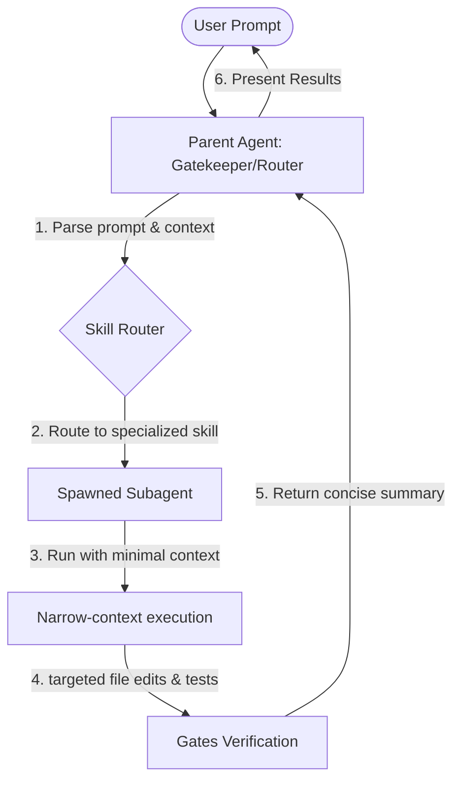

# RIDP Platform — Durable Agentic Router & Subagent Orchestration

This document defines the architectural system and operational protocol for cost-efficient, high-precision task execution in the RIDP platform using specialized, narrow-context subagents.

---

## 1. High-Level Orchestration Flow

To minimize main token usage and optimize cost, the **Parent Agent (Antigravity)** acts strictly as a **Gatekeeper and Router**. It does not perform heavy tasks (such as broad file searches, code edits, or testing) in its own context window. 

Instead, the workflow follows a strictly delegated pattern:

---

## 2. Subagent Directory & Skill Router

We have defined and registered the following subagents corresponding to the skill routers in `AGENTS.md`:

| Subagent Name | Description / Scope | Target SKILL.md Instructions |
| :--- | :--- | :--- |
| **`ridp-backend-flask`** | Python/Flask routes, schemas, services, models, authz, tenancy, Celery, OpenAPI, backend tests. | `form-backend/.agents/skills/ridp-backend-flask/SKILL.md` |
| **`ridp-frontend-flutter`** | Flutter/Dart UI, routing, state, form rendering, Smart Grid, visual design, frontend tests. | `frontend/.agents/skills/ridp-frontend-flutter/SKILL.md` |
| **`ridp-api-contract-sync`** | API compatibility, OpenAPI regenerations, generated Dart client synchronizations. | `form-backend/.agents/skills/ridp-api-contract-sync/SKILL.md` |
| **`ridp-senior-planner`** | High-level planning, database migrations, refactors, security/tenancy audits. | `form-backend/.agents/skills/ridp-senior-planner/SKILL.md` |
| **`ridp-code-reviewer`** | PR reviews, security/tenancy audits, bug hunting, contract compatibility reviews. | `form-backend/.agents/skills/ridp-code-review/SKILL.md` |
| **`ridp-quality-gates`** | Lint checks, OpenAPI verification, running complete test suites, handoff readiness checks. | `form-backend/.agents/skills/ridp-quality-gates/SKILL.md` |

---

## 3. Context Hardening & Cost Minimization Rules

To ensure that your token consumption remains as low as possible:

1. **Gatekeeper Routing**: The parent agent's context is kept extremely clean. Whenever a user submits a prompt, the parent agent maps the request to a subagent and immediately calls `invoke_subagent` without loading massive file snippets into the parent conversation context.
2. **Minimal Prompt Shape**: Parent prompts must stay short and structured:
   - outcome
   - exact files or symbols
   - constraints and risk boundary
   - expected return format
   Avoid background narratives and repeated repo policy.
3. **Narrow Context Isolation**: When subagents are spawned, they are instructed to:
   - Inherit a clean workspace.
   - Avoid reading files blindly. They must only read the specific, targeted files required for their direct task.
   - Prefer graph-backed discovery and symbol reads before shell-wide search.
   - Execute lightweight commands first (e.g. host-side virtualenv test runs `./venv/bin/pytest tests/test_file.py`) rather than starting large container clusters unless necessary.
4. **One Task Per Subagent**: Split discovery, implementation, and verification unless the task is trivial. If a task spans backend and frontend, create separate repo-local subagents.
5. **Concise Aggregation**: Subagents report back only the structural changes (a diff summary, compilation status, and green verification runs). The parent agent then formats this summary cleanly for the user, keeping the conversation history short.

---

## 4. Operational Invariant

Whenever the user submits a new prompt:
- **Parent Agent Action**: Propose the matching subagent, formulate the narrow-context instruction, invoke the subagent using `invoke_subagent`, and sleep.
- **Subagent Action**: Perform the task following the exact corresponding `SKILL.md` execution rules, run targeted tests to verify, and return the completed task summary.
- **Parent Agent Completion**: Report results to the user with references to modified files or generated artifacts.
